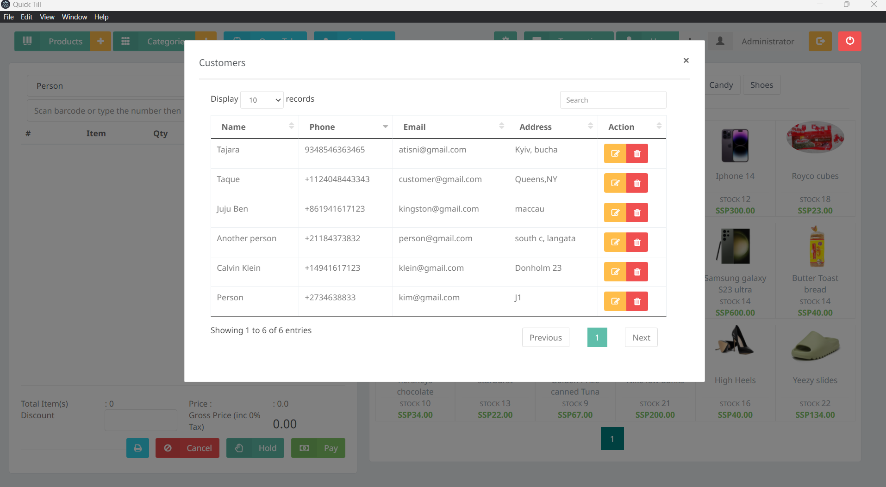

# Qucik Till Point of Sale

 Desktop Point of Sale app built with electron
 
  **Features:**

- Can be used by multiple PC's on a network with one central database.
- Receipt Printing.
- Search for product by barcode.
- Staff accounts and permissions. 
- Products and Categories.
- Basic Stock Management.
- Open Tabs (Orders).
- Customer Database. 
- Transaction History. 
- Filter Transactions by Till, Cashier or Status. 
- Filter Transactions by Date Range. 

**To Customize/Create your own installer**

- Clone this project.
- Open terminal and navigate into the cloned folder.
- Run "yarn install" to install dependencies.
- Run "yarn electron". 

**To build the app**

- Open terminal and navigate into the cloned folder.
- Run "yarn electron-build" to build.
- A dist folder is created where the app is located. 

<!-- 

 -->
